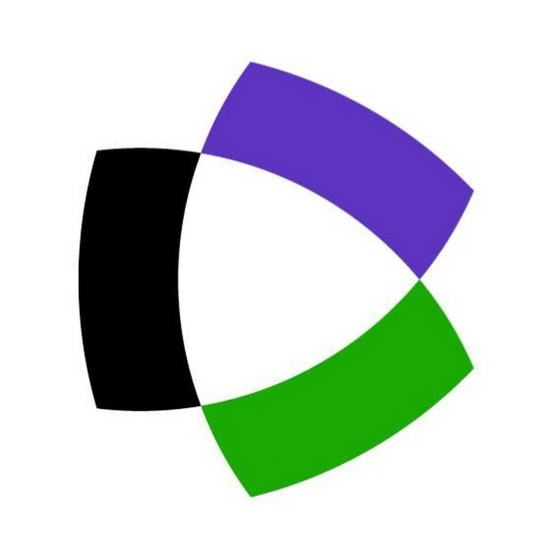
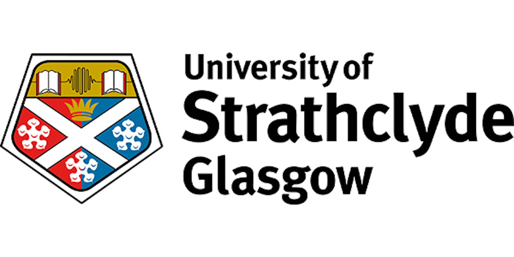
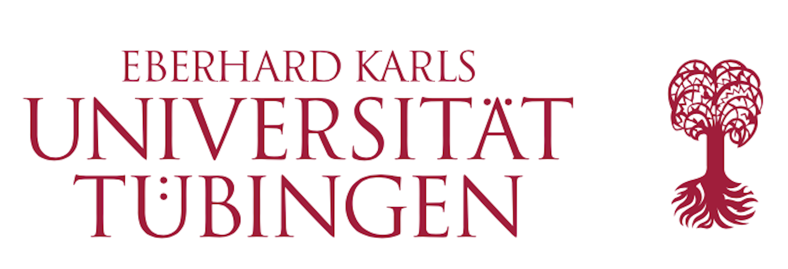
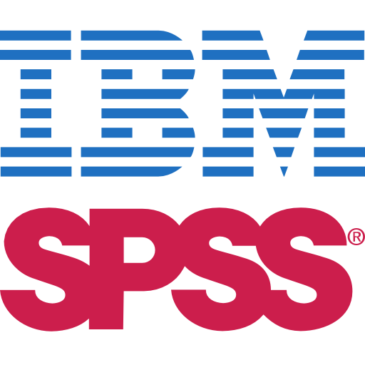

---
# new_design — redesigned About page (preview). Does not replace author.qmd.
title: ""
pagetitle: "About Amr Mahmoud | AMRBiostats"
description: "Meet Amr Mahmoud, Professor of Pharmacology with an MSc in Applied Statistics, and creator of AMRBiostats — an educational platform for biostatistics and R programming."
format:
  html:
    page-layout: full
    toc: false
    sidebar: false
    comments: false
    grid:
      body-width: 1180px
      margin-width: 0px
      sidebar-width: 0px
      gutter-width: 0rem
---

```{=html}
<link rel="stylesheet" href="styles_about.css">

<div class="amr-ab">

  <!-- ============ HERO ============ -->
  <section class="amr-ab-hero">
    <div class="amr-ab-photo">
      
    </div>
    <div class="amr-ab-copy">
      <div class="amr-ab-eyebrow">About the author</div>
      <h1>Amr Mahmoud</h1>
      <div class="amr-ab-chips">
        <span class="amr-ab-chip">Professor of Pharmacology</span>
        <span class="amr-ab-chip">MSc Applied Statistics (Health Sciences)</span>
        <span class="amr-ab-chip gradstat">Royal Statistical Society GradStat</span>
      </div>
      <p class="amr-ab-intro">With a PhD in Pharmacology and an MSc in Applied Statistics, I combine pharmacology and biostatistics to help researchers in the health sciences design rigorous studies, analyze their data, and publish reliable results. Over the past two decades, I have taught hundreds of students and collaborated on many research projects. I'm passionate about statistics and love demystifying complex concepts and methods to make them accessible to learners at all levels.</p>
      <div class="amr-ab-actions">
        <a class="amr-ab-btn consult" href="mailto:consultation@amrbiostats.com">
          <svg class="amr-ab-mail" viewBox="0 0 24 24" fill="none" stroke="url(#amrMail)" stroke-width="2.35" stroke-linecap="round" stroke-linejoin="round" aria-hidden="true">
            <defs><linearGradient id="amrMail" x1="0" y1="0" x2="24" y2="24">
              <stop offset="0" stop-color="#ff8a00"/><stop offset=".32" stop-color="#ff3d77"/><stop offset=".68" stop-color="#7b2ff7"/><stop offset="1" stop-color="#0466c8"/>
            </linearGradient></defs>
            <rect x="3" y="5" width="18" height="14" rx="2.5"/>
            <path d="M4 7.5l8 5.5 8-5.5"/>
          </svg>
          Book a consultation
        </a>
      </div>
      <div class="amr-ab-social">
        <a class="s-linkedin" href="https://www.linkedin.com/in/amr-mahmoud-635496196/" target="_blank" rel="noopener" aria-label="LinkedIn profile">
          <svg viewBox="0 0 24 24" fill="currentColor"><path d="M19 3a2 2 0 0 1 2 2v14a2 2 0 0 1-2 2H5a2 2 0 0 1-2-2V5a2 2 0 0 1 2-2h14zM8.34 18.34V9.99H5.67v8.35h2.67zM7 8.5a1.55 1.55 0 1 0 0-3.1 1.55 1.55 0 0 0 0 3.1zm11.34 9.84v-4.59c0-2.45-1.31-3.59-3.06-3.59-1.41 0-2.04.78-2.39 1.32v-1.13h-2.67v8.35h2.67v-4.66c0-.25.02-.49.09-.67.2-.49.64-1 1.39-1 .98 0 1.37.74 1.37 1.83v4.5h2.6z"/></svg>
          LinkedIn
        </a>
        <a class="s-orcid" href="https://orcid.org/0000-0003-2959-0692" target="_blank" rel="noopener" aria-label="ORCID profile">
          <svg viewBox="0 0 24 24" fill="currentColor"><path d="M12 2a10 10 0 1 0 0 20 10 10 0 0 0 0-20zM8.4 17.3H6.9V8.9h1.5v8.4zM7.6 7.6a.9.9 0 1 1 0-1.8.9.9 0 0 1 0 1.8zm9.7 6c0 2.3-1.5 3.7-3.9 3.7h-3V8.9h3c2.3 0 3.9 1.4 3.9 3.6v1.1zm-1.6-1.1c0-1.6-1-2.5-2.6-2.5h-1.2v6h1.2c1.5 0 2.6-.9 2.6-2.5v-1z"/></svg>
          ORCID
        </a>
        <a class="s-scholar" href="https://scholar.google.com/citations?user=S_scZMkAAAAJ&hl=en" target="_blank" rel="noopener" aria-label="Google Scholar profile">
          <svg viewBox="0 0 24 24" fill="currentColor"><path d="M12 2 1 8l11 6 9-4.9V16h2V8L12 2zM5 13.2v3.3c0 1.6 3.1 3.5 7 3.5s7-1.9 7-3.5v-3.3l-7 3.8-7-3.8z"/></svg>
          Google Scholar
        </a>
        <a class="s-wos" href="https://www.webofscience.com/wos/author/record/Y-7062-2019" target="_blank" rel="noopener" aria-label="Web of Science profile">
          
          Web of Science
        </a>
      </div>
    </div>
  </section>

  <!-- ============ WHY ============ -->
  <section class="amr-ab-section">
    <h2 class="amr-ab-h2">Why I built AMRBiostats</h2>
    <div class="amr-ab-panel">
      <p>In my own journey learning statistics, I often struggled to find reliable resources that explain concepts and methods clearly, or that suggest alternative approaches when a model's assumptions aren't met. The statistical jargon made it harder still because it was rarely explained in plain terms. So I built AMRBiostats, hoping it can be a hub of trusted biostatistics tutorials and resources that makes learning easier.</p>
    </div>
  </section>

  <!-- ============ EDUCATION ============ -->
  <section class="amr-ab-section">
    <h2 class="amr-ab-h2">Education</h2>
    <div class="amr-ab-timeline">
      <div class="amr-ab-degree">
        <span class="amr-ab-uni-mark">
          
        </span>
        <span class="deg">MSc in Applied Statistics (Health Sciences)<span>University of Strathclyde, UK</span></span>
        <span class="yr">2021–2024</span>
      </div>
      <div class="amr-ab-degree">
        <span class="amr-ab-uni-mark">
          
        </span>
        <span class="deg">PhD in Pharmacology<span>University of Tübingen, Germany</span></span>
        <span class="yr">2007–2011</span>
      </div>
      <div class="amr-ab-degree">
        <span class="amr-ab-uni-mark">
          
        </span>
        <span class="deg">MSc in Pharmacology<span>Zagazig University, Egypt</span></span>
        <span class="yr">2000–2004</span>
      </div>
      <div class="amr-ab-degree">
        <span class="amr-ab-uni-mark">
          
        </span>
        <span class="deg">BSc in Pharmacy<span>Zagazig University, Egypt</span></span>
        <span class="yr">1995–2000</span>
      </div>
    </div>
  </section>

  <!-- ============ TOOLS ============ -->
  <section class="amr-ab-section">
    <h2 class="amr-ab-h2">Statistical tools I teach and use</h2>
    <div class="amr-ab-tools">
      <span class="amr-ab-tool r">
        
        R 
      </span>
      <span class="amr-ab-tool rstudio">
        
        RStudio
      </span>
      <span class="amr-ab-tool spss">
        
        SPSS
      </span>
      <span class="amr-ab-tool minitab">
        
        Minitab
      </span>
      <span class="amr-ab-tool prism">
        
        GraphPad Prism
      </span>
      <span class="amr-ab-tool jamovi">
        
        Jamovi
      </span>
    </div>
  </section>

</div>
```
